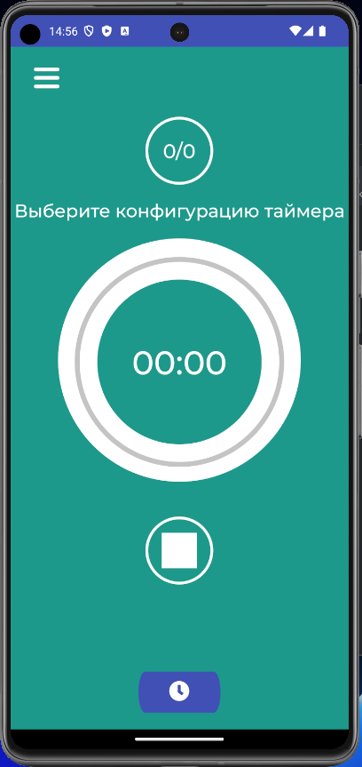

## pomodoro_app
Приложение - фокусировочный таймер по технике Pomodoro.

## Паттерны проектирования

В данном проекте реализовано несколько паттернов проектирования. 

Мною были выбраны следующие паттерны проектирования:

- Шаблонный метод (Template Method)
- Одиночка (Singleton)

Шаблонный метод относится к категории паттернов поведения и служит одной простой цели - определить основу класса и создать возможность подклассам переопределять некоторые части родительского класса, при этом не изменяя его структуру в целом.
В данной работе есть абстрактный класс Timer и дочерние классы RestTimer, StartTimer, FocusTimer. В родительском классе определены основные поля и методы, а также абстрактные методы, которые будут переопределяться в соответствующих подклассах. Шаблонный метод позволил нам определить общий алгоритм поведения подклассов, избегая дублирования кода.

Для класса Bridge (мостик) был использован паттерн "Одиночка". Этот паттерн гарантирует, что у класса есть только один экземпляр, и предоставляет к нему глобальную точку доступа.

## UML диаграммы

Диаграмма деятельности:

Диаграмма коммуникации:

Диаграмма последовательности

Диаграмма вариантов использования

## Скриншоты приложения

